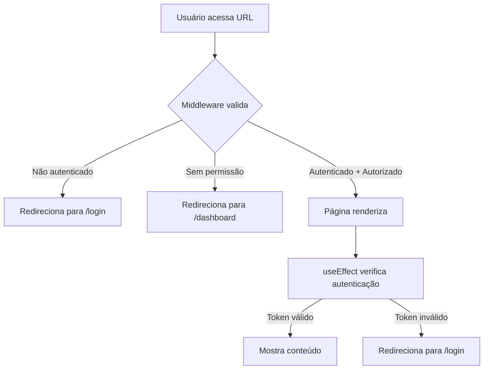

# Proteção de Rotas - Documentação de Autenticação

## Resumo das Mudanças

Foi implementado um sistema robusto de proteção de rotas para garantir que usuários não autenticados ou sem permissões não consigam acessar áreas restritas do site.

## Como Funciona

### 1. **Middleware (src/middleware.ts)**
Um middleware do Next.js foi criado para proteger as rotas no servidor, **antes mesmo de renderizar a página**. Isso oferece a melhor segurança possível.

**Rotas Protegidas:**
- `/dashboard` - Apenas usuários autenticados
- `/clientes` - Apenas usuários autenticados
- `/estoque` - Apenas usuários autenticados
- `/admin` - Apenas usuários com role `admin`

**Rotas Públicas (sem proteção):**
- `/login` - Página de login
- `/` - Página raiz (redireciona para /login)

**Comportamento:**
- ✅ Usuário não autenticado tenta acessar `/admin` → Redireciona para `/login`
- ✅ Usuário não autenticado tenta acessar `/dashboard` → Redireciona para `/login`
- ✅ Usuário comum tenta acessar `/admin` → Redireciona para `/dashboard`
- ✅ Usuário autenticado tentando acessar `/login` → Redireciona para `/dashboard`

### 2. **Componente ProtectedPageWrapper (src/components/ProtectedPageWrapper.tsx)**
Um componente React reutilizável que fornece uma camada adicional de proteção no lado do cliente.

**Uso:**
```tsx
import ProtectedPageWrapper from "@/components/ProtectedPageWrapper";

export default function AdminPage() {
  return (
    <ProtectedPageWrapper requiredRole="admin">
      {/* Conteúdo da página */}
    </ProtectedPageWrapper>
  );
}
```

**Props:**
- `requiredRole`: `"admin"` ou `"user"` (padrão: "user")
- `fallbackRedirect`: URL para redirecionar se não autenticado (padrão: "/login")

### 3. **API de Autenticação**
As rotas existentes continuam funcionando:

- `POST /api/auth/login` - Faz login e cria cookie `auth_user`
- `GET /api/auth/me` - Verifica autenticação atual
- `POST /api/auth/logout` - Desconecta o usuário

## Fluxo de Autenticação



## Estrutura de Usuário (auth_user cookie)

```json
{
  "id": "string",
  "name": "string",
  "email": "string",
  "role": "admin" | "user"
}
```

## Testes Recomendados

1. **Acessar sem autenticação:**
   - Tente acessar `http://localhost:3000/admin` sem estar logado
   - Deve redirecionar para `/login`

2. **Usuário comum tentando acessar /admin:**
   - Faça login com um usuário que tenha `role: "user"`
   - Tente acessar `http://localhost:3000/admin`
   - Deve redirecionar para `/dashboard`

3. **Admin acessando /admin:**
   - Faça login com um usuário que tenha `role: "admin"`
   - Acesse `http://localhost:3000/admin`
   - Deve carregar a página normalmente

## Notas de Segurança

- ⚠️ **O middleware atua no servidor** - Oferece a melhor proteção
- ⚠️ **Cookies são HttpOnly** - Protegidos contra XSS
- ⚠️ **Validação em duas camadas** - Middleware + Component para redundância
- ⚠️ **Sem permissão no cliente** - Sempre redireciona do servidor

## Próximos Passos (Opcional)

Para aumentar ainda mais a segurança, considere:

1. Adicionar **CSRF tokens** nos forms
2. Implementar **refresh tokens** com expiração
3. Usar **JWT** em vez de cookies simples
4. Adicionar **rate limiting** no login
5. Registrar tentativas de acesso não autorizado (audit logs)

---

## Funcionalidade: "Lembre de Mim"

### O que é?

Permite que usuários opcionalmente salvem suas credenciais no navegador para fazer login automaticamente na próxima vez.

### Como Funciona

1. **Na página de login:**
   - Checkbox "Lembre de mim" abaixo do campo de senha
   - Se marcado ao fazer login, credenciais são salvas no `localStorage`

2. **Na próxima visita:**
   - Ao abrir a página de login, verifica se há credenciais salvas
   - Se houver, preenche automaticamente os campos

3. **Ao fazer logout:**
   - Clicando no botão "Sair" (no Navbar)
   - As credenciais salvas são removidas do `localStorage`

### Implementação Técnica

**Armazenamento:**
```javascript
localStorage.setItem(
  "rememberMe_credentials",
  JSON.stringify({ email, password })
);
```

**Limpeza:**
```javascript
localStorage.removeItem("rememberMe_credentials");
```

**Carregamento (useEffect):**
```typescript
const savedCredentials = localStorage.getItem("rememberMe_credentials");
if (savedCredentials) {
  const { email, password } = JSON.parse(savedCredentials);
  // Preencher campos automaticamente
}
```

### Componentes Afetados

- `src/app/login/page.tsx` - Adiciona checkbox e lógica de salvamento
- `src/components/Navbar.tsx` - Limpa credenciais ao fazer logout

### Segurança

⚠️ **Notas Importantes:**

- Credenciais são armazenadas em **texto plano** no localStorage
- Ideal apenas para **desenvolvimento** ou **máquinas pessoais**
- Para produção, considere:
  - Criptografar as credenciais antes de salvar
  - Usar `sessionStorage` em vez de `localStorage` (mais seguro)
  - Implementar **tokens de sessão** em vez de armazenar senha
  - Adicionar **device fingerprinting** para validação extra

### Como Testar

1. Abra a página de login: `http://localhost:3000/login`
2. Preencha email e senha
3. **Marque** "Lembre de mim"
4. Clique em "Entrar"
5. Faça logout
6. Abra a página de login novamente
7. Campos devem estar preenchidos automaticamente
8. Faça login novamente
9. Na próxima vez que deslogar e abrir login, os campos aparecerão vazios (pois o logout limpa)
